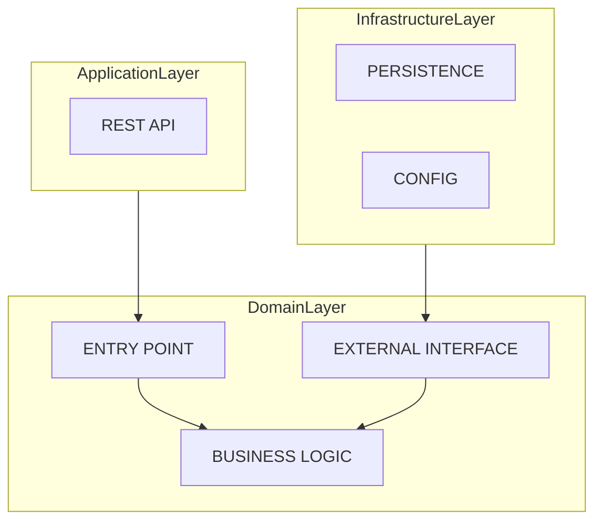
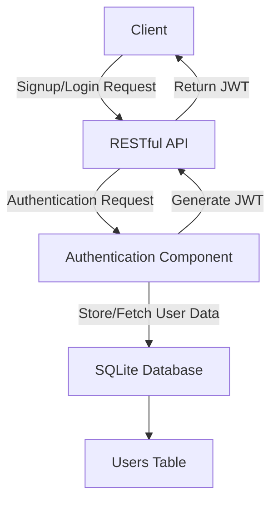
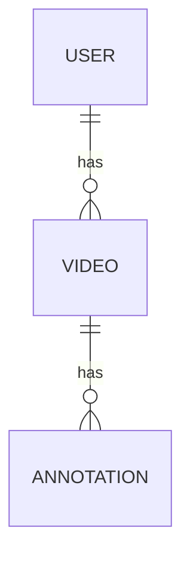

# ADR 1: Selection of Architecture Design

**Title**: Adoption of Hexagonal Architecture with JWT-based Authentication for Video Management API

**Date**: 13/08/2023

**Status**: Accepted

## **Context**:

We aim to design a RESTful API to manage videos and related annotations. Each video may have multiple annotations that capture time-related information about the video. For instance, an annotation might reference a segment of the video from `00:04:00` to `00:05:00` that contains an advertisement. The system will use SQLite for data persistence and will be written in Go.

## **Decision**:

1. **Hexagonal Architecture**:
   - We will adopt a hexagonal architecture (also known as ports and adapters) for our application. This architecture will allow us to isolate the application's core logic from external concerns, making the system more maintainable and adaptable to change.
   - The core application will interact with databases, external services, and other systems through well-defined ports, ensuring a clean separation of concerns.

2. **JWT-based Authentication**:
   - We will implement JWT (JSON Web Tokens) for authentication and authorization.
   - The system will provide signup and login endpoints for users to create and authenticate their accounts.
   - Upon successful authentication, the system will generate a JWT, which the client must include in subsequent API requests.
   - The JWT will contain claims about the user, allowing for fine-grained access control.

3. **SQLite Database**:
   - SQLite will be used as the database to store video and annotation data.
   - **Data Structure**:
      1. **USER Table**:
         - `username`: String (Primary Key)
         - `password`: String (hashed and salted)
         - `email`: String

      2. **VIDEO Table**:
         - `video_id`: Integer (Primary Key)
         - `title`: String
         - `description`: String
         - `link`: String (URL to the video)
         - `uploadDate`: Date
         - `user_id`: Foreign Key referencing USER

      3. **ANNOTATION Table**:
         - `annotation_id`: Integer (Primary Key)
         - `description`: String
         - `startTime`: Time
         - `endTime`: Time
         - `video_id`: Foreign Key referencing VIDEO

The diagram illustrates that:
- A `USER` can have multiple `VIDEOS`.
- A `VIDEO` can have multiple `ANNOTATIONS`.

4. **Endpoints**:
   - The API will have endpoints for CRUD operations on videos and annotations.
   - Additionally, there will be endpoints for user signup and login.

## **Consequences**:

1. **Maintainability**:
   - The hexagonal architecture will make the system more maintainable by isolating core logic from external interfaces.
   
2. **Scalability**:
   - JWT-based authentication is stateless, allowing the system to scale horizontally without the need for shared session storage.

3. **Security**:
   - JWT provides a secure way of transmitting information between the client and server. However, we must ensure tokens are stored securely on the client side and implement best practices like token expiration and rotation.

4. **Simplicity**:
   - SQLite offers a lightweight and serverless database solution, simplifying deployment and reducing operational overhead.

